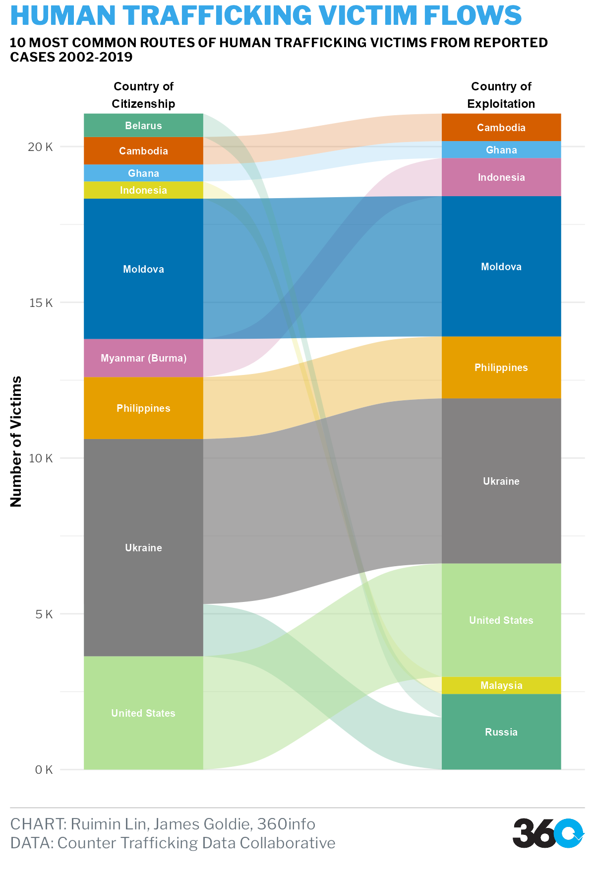

# Migration's Changing Face

The project attempts to raise the awareness of illegal and trafficked migrants for the public on International Refugees Day. Visualisations on migrants will be focused on discovering two aspects, missing migrants, and human trafficking overtime. 

Graphics are in the [`out`](./out) folder.





## Use + Remix rights

](https://mirrors.creativecommons.org/presskit/buttons/80x15/png/by.png)

These charts, as well as the analyses that underpin them, are available under a Creative Commons Attribution 4.0 licence. This includes commercial reuse and derivates.

<!-- Do any of the data sources fall under a different licence? If so, describe the licence and which parts of the data fall under it here! if most of it does, change the above and replace LICENCE.md too -->

Data in these charts comes from:

- [Missing Migrants Project](https://missingmigrants.iom.int/) 
- [Counter Trafficking Data Collaborative](https://www.ctdatacollaborative.org/dataset/resource/511adcb7-b1a2-4cc7-bf2f-0960d43a49cc) 


**Please attribute 360info and the data sources when you use and remix these visualisations.**

## Reproduce the analysis

We typically publish graphics using [Quarto](https://quarto.org) notebooks, which can be found in the`*.qmd` files. Quarto allows reproducible analysis and visualisation to be done in a mix of languages, but we typically use [R](https://r-project,.org) and [Observable JS](https://observablehq.com/@observablehq/observables-not-javascript).

You'll need to:
- [Download and install Quarto](https://quarto.org/docs/get-started)
- [Download the install R](https://www.r-project.org)
- Satisfy the R package dependencies. In R:
  * Install the [`renv`](https://rstudio.github.io/renv) package with `install.packages("renv")`,
  * Then run `renv::restore()` to install the R package dependencies.
  * (For problems satisfying R package dependencies, refer to [Quarto's documentation on virtual environments](https://quarto.org/docs/projects/virtual-environments.html).)

Now, render the `.qmd` files to the `/docs` directory with:

```sh
quarto render --output-dir docs *.qmd
```

## Help

<!-- replace `report-template` with the name of this repo in the link below  -->

If you find any problems with our analysis or charts, please feel free to [create an issue](https://github.com/360-info/report-template/issues/new)!

