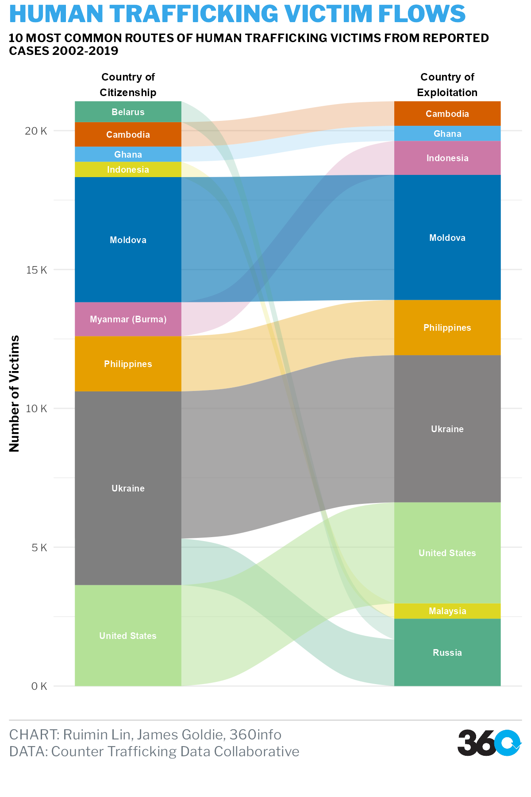
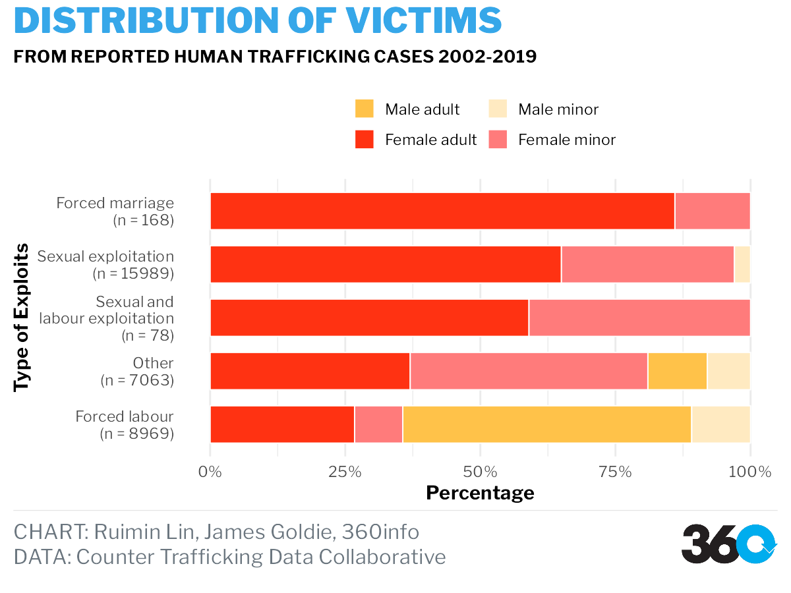

```{r setup, include=FALSE}
options(htmltools.dir.version = FALSE)
knitr::opts_chunk$set(
  fig.width=9, fig.height=8, fig.retina=3,
  out.width = "90%",
  out.height = "80%",
  cache = FALSE,
  echo = FALSE,
  message = FALSE, 
  warning = FALSE,
  hiline = TRUE
)

#### PLEASE RUN report-migration.Rmd PRIOR TO SUCCESSFULLY RUN THIS FILE###############################################
```


```{r library, include=FALSE}
library(plotly)
library(countrycode)
# devtools::install_github("timelyportfolio/parsetR")
# or
# remotes::install_github("timelyportfolio/parsetR")
library(parsetR)
library(ggalluvial)
# https://fonts.google.com/specimen/Libre+Franklin the font must be downloaded and installed to use themes360info package
# remotes::install_github("360-info/themes360info")
library(themes360info)
library(scales)
library(ggtext)
library(forcats)
library(knitr)
library(kableExtra)
library(gridExtra)
library(tidyverse)
library(patchwork)
library(xaringan)
library(xaringanExtra)
library(tidyverse)

```

```{r xaringan-extra, include=FALSE}
xaringanExtra::use_scribble()
xaringanExtra::use_panelset()
```


class: middle, inverse

## Introduction


---

# Introduction

## Background and Motivation

--

◾ Migration is the movement of an individual/a group of people from its usual place of residence to another place (within the country of residence or internationally) temporarily or permanently.

--

◾ Apart from legal migrants, illegal migrants often took high risk sea travel to move away from its country of residence.

--

◾ A considerable number of migrants are being trapped under modern slavery and being forced to provide primarily labour/sexual services for free.

---
# Introduction

.panelset[

  .panel[.panel-name[Aim]
--

### This visualisation project aims to raise the public awareness of illegal and trafficked migrants, in corporation with [360info](https://360info.org/) platform.

#### ◾ Visualisations produced will be focusing on the following aspects:


-	The missing and dead migrants overtime across regions
-	The route of trafficking, from which country most victims are located at, and to which country most victims are exploited?
-	Demographic features of victims and how it is related to type of exploits.


]

  .panel[.panel-name[Data Description 1]
  
#### Data for missing migrants:

- [Missing Migrants Project](https://missingmigrants.iom.int/)

```{r}
t1 <- tibble(
  Variable = c("Incident year", "Region of Incident", "Total Number of Dead and Missing"),
  Description = c("Year of incident reported",
                  "Region of incident happened",
                  "Total number of dead and missing migrants recorded by the incident, minimum 0")
)

t1 %>%
  kable(caption = "Variable description for Missing Migrants data") %>%
  column_spec(1, bold = TRUE) %>%
  kable_styling() %>%
  kable_paper() %>%
  footnote(general = "Data collected from Missing Migrants Project")
```


]

  .panel[.panel-name[Data Description 2]

#### Data for human trafficking:

- [Counter Trafficking Data Collaborative](https://www.ctdatacollaborative.org/dataset/resource/511adcb7-b1a2-4cc7-bf2f-0960d43a49cc)

```{r}
t2 <- tibble(
  Variable = c("Type of Exploits", "Gender Group",
               "Country of Citizenship", "Country of Exploitation"),
  Description = c("Type of exploits identified from reported victims",
                  "Indicates the reported victim's gender and whether the victims is under the age of 18 or older at the time the victim is registered. The variable consists of combination of original variables gender and majorityStatus.",
                  "Indicates the nationality of the reported victim",
                  "Indicates the last country where the victim was exploited")
)

t2 %>%
  kable(caption = "Variable description for Human Trafficking data") %>%
  column_spec(1, bold = TRUE) %>%
  kable_styling() %>%
  kable_paper() %>%
  footnote(general = "Data collected from Coutner Trafficking Data Collaborative")
```


  ]

]

---
class: middle, inverse

## Discussion and Results

---

# Discussion and Results

## The missing and dead migrants overtime across regions

.panelset[
   .panel[.panel-name[Version 1]
 
 .pull-left[  
```{r}
mg <- read_csv("data/Missing_Migrants_Global_Figures_allData.csv")

mg <- mg %>%
  mutate_at(vars(8:14),
            funs(ifelse(is.na(.),0,.)))

mg1 <- mg %>%
  select(`Incident year`,
         `Region of Incident`,
         `Total Number of Dead and Missing`)

mg1 <- mg1 %>%
  group_by(`Incident year`, `Region of Incident`) %>%
  summarise(`Total Number of Dead and Missing` = sum(`Total Number of Dead and Missing`)) %>%
  ungroup()


mg1 <- mg1 %>%
  complete(`Incident year`,
           `Region of Incident`)

mg1[is.na(mg1)] <- 0


mg1a <- mg1 %>%
  group_by(`Region of Incident`) %>%
  summarise(`Region total` = sum(`Total Number of Dead and Missing`)) %>%
  mutate(pct = round((`Region total`/sum(`Region total`)),4),
         Label = paste0(round(pct*100,1), "%"))

mg1b <- mg1 %>%
  mutate(`Incident year` = as.character(`Incident year`)) %>%
  group_by(`Incident year`) %>%
  summarise(`Year total` = sum(`Total Number of Dead and Missing`)) %>%
  mutate(pct = round((`Year total`/sum(`Year total`)),4),
         Label = paste0(round(pct*100,1), "%"))

mhmv1 <- mg1 %>%
  mutate(`Incident year` = as.character(`Incident year`)) %>%
  ggplot(aes(x = `Incident year`,
             y = `Region of Incident`,
             fill = `Total Number of Dead and Missing`)) +
  geom_tile() +
  geom_text(aes(label = `Total Number of Dead and Missing`)) +
  scale_fill_gradient(low = "white", high = "red") +
  theme_minimal() +
  ggtitle("Heatmap version 1")

mhmv1
```
  ]
  
  .pull-right[
  ◾ Does not have the ability to tell audience the number changing overtime.
  
  ◾ Two marginal plots added.
]
  ]
   
  .panel[.panel-name[Version 2]
  
  .pull-left[
  
```{r}
mhm1 <- mg1 %>%
  mutate(`Incident year` = as.character(`Incident year`)) %>%
  ggplot(aes(x = `Incident year`,
             y = `Region of Incident`,
             fill = `Total Number of Dead and Missing`)) +
  geom_tile(colour = "black") +
  geom_text(aes(label = `Total Number of Dead and Missing`),
            size = 3) +
  scale_fill_gradient(low = "white", high = "red") +
  theme_minimal() +
  guides(fill="none") +
  theme(plot.caption = element_text(hjust = 0),
        axis.title.x = element_blank()) +
  labs(caption = "DATA: Missing Migrants Project")

mhm2 <- mg1a %>%
  ggplot(aes(x = `Region of Incident`, 
             y = pct,
             alpha = pct)) +
  geom_col(width = .7,
           fill = "red") +
  geom_text(aes(label = Label), hjust = -0.2, size = 3) +
  scale_y_continuous(expand = expansion(mult = c(.0, .25))) +
  theme_void() +
  scale_alpha_continuous(range = c(0.5, 1)) +
  guides(alpha="none") +
  coord_flip()

mhm3 <- mg1b %>%
  ggplot(aes(x = `Incident year`,
             y = pct,
             alpha = pct)) +
  geom_col(width = .7,
           fill = "red") +
  geom_text(aes(label = Label), vjust = -0.5, size = 3) +
  scale_y_continuous(expand = expansion(mult = c(.0, .25))) +
  theme_void() +
  scale_alpha_continuous(range = c(0.5, 1)) +
  guides(alpha="none") +
  labs(title = toupper("Dead and Missing Migrants"),
       subtitle = toupper(paste(
         "Number of dead and missing migrants from reported",
         "incidents 2014-2022",
         sep = "\n")))

layout <- "
AA#
BBC
BBC
BBC
BBC"
mhmp1 <- mhm3 + mhm1 + mhm2 + plot_layout(design = layout)

mhmp1 
```
  ]
  
  .pull-right[
  ◾ The major region of migrant found dead and missing is Mediterranean.
  
  ◾ Mediterranean taking up 46.3% of overall dead and missing migrants across the regions. 
  
  ◾ Followed by Northern Africa (13.9%), North America (6%) and South-eastern Asia (5.9%).
  
  ◾ Peak year of dead and missing is 2022.
]
  
  ]
]

---

# Discussion and Results

## The route of trafficking

.panelset[
   .panel[.panel-name[Version 1]
 
 .pull-left[
 
```{r}
ht <- read_csv("data/The Global Dataset 14 Apr 2020.csv")


ht <- ht %>%
  select(-1) %>% # deselect unused column
  na_if(-99)     # replace all -99 values with NA as defined in the codebook

ht$typeOfExploitConcatenated[ht$typeOfExploitConcatenated ==
                               "Forced labour;Sexual exploitation;Combined sexual and labour exploitation"] <- "Sexual and labour exploitation"
```

```{r}
ht1 <- ht %>%
  select(yearOfRegistration,
         gender,
         ageBroad, citizenship,
         CountryOfExploitation)%>%
  mutate(yearOfRegistration = as.character(yearOfRegistration))

ht1a <- ht1 %>%
  mutate(citizenship = countrycode(citizenship, origin = 'iso2c',
                                   destination = 'country.name'),
         CountryOfExploitation = countrycode(CountryOfExploitation, origin = 'iso2c',
                                             destination = 'country.name')) %>%
  drop_na(citizenship, CountryOfExploitation)

ht1b <- ht1a %>%
  group_by(citizenship, CountryOfExploitation)%>%
  summarize(counts = n()) %>%
  ungroup() %>%
  arrange(desc(counts)) %>%
  head(10)

ht1b <- ht1b %>%
  rename(CountryOfOrigin = citizenship)

```


```{r routesv1}
parset(ht1b, dimensions = c('CountryOfOrigin', 'CountryOfExploitation'), 
       value = htmlwidgets::JS("function(d){return d.counts}"), 
       tension = 0.5)

```

## 😞 Failed to demonstrate the html widget, check report-migration.html

]
 .pull-right[
 ◾ The html widget has a lot of restriction in customizing the visualisation.
 
 ◾ Title and variable names cannot be modified.
 
 ◾ Unable to customize themes.
 
 ◾ Goes back to static visualisation, using function `gg_alluvium` and `gg_stratum`.
]
 ]
 
   .panel[.panel-name[Version 2]
   
 .pull-left[
 
 
```{r}
t1 <- grobTree(textGrob("Country of\nCitizenship",
                        gp=gpar(fontsize=13, fontface="bold",
                                fontfamily = "body360info")))

t2 <- grobTree(textGrob("Country of\nExploitation",
                        gp=gpar(fontsize=13, fontface="bold",
                                fontfamily = "body360info")))

# part of colour codes refer to https://thenode.biologists.com/data-visualization-with-flying-colors/research/
Okabe_Ito <- c("#D55E00", "#56B4E9", "#CC79A7", "#DDD723",
               "#0072B2", "#E69F00", "#55AD89", "#848282",
               "#B4E197")
# country of citizenship
# country of exploitation

victimflow <- ht1b %>%
  ggplot(aes(y = counts,
             axis1 = CountryOfOrigin,
             axis2 = CountryOfExploitation)) +
  geom_alluvium(aes(fill = CountryOfExploitation,
                    alpha = counts)) +
  geom_stratum(
    aes(fill = CountryOfExploitation),
    colour = NA) +
  scale_fill_manual(values = Okabe_Ito) +
  geom_text(stat = "stratum",
            aes(label = after_stat(stratum),
                fontface = 2),
            colour = "#FFFFFF",
            family = "body360info") +
  guides(fill="none",
         alpha = "none") +
  scale_x_continuous(breaks = NULL) +
  scale_y_continuous(labels = label_number(suffix = " K", scale = 1e-3)) +
  scale_alpha_continuous(range = c(0.2, 0.7)) +
  annotation_custom(t1,xmin=1,xmax=1,ymin=21200,ymax=Inf) +
  annotation_custom(t2,xmin=2,xmax=2,ymin=21200,ymax=Inf) +
  ylab("Number of Victims") +
  labs(title = toupper("Human Trafficking Victim Flows"),
       subtitle = toupper(paste(
         "10 Most common routes of human trafficking victims from reported",
         "cases 2002-2019",
         sep = "\n")),
       caption = paste(
         "**CHART:** Ruimin Lin, James Goldie, 360info",
         "**DATA:** Counter Trafficking Data Collaborative",
         sep = "<br>")) +
  theme_360() +
  theme(axis.text.x = element_blank(),
        axis.ticks.x = element_blank(),
        panel.background = element_blank())

save_360plot(victimflow, "out/figures/victimflows.png",
             shape = "photo-portrait")

```

 
```{r routesv2, echo=FALSE, out.width="80%", fig.cap="Routes v2"}

```
]
 .pull-right[
 ◾ The opacity of the flow between `Country of Citizenship` and `Country of Exploitation` indicates number of victims.
 
 ◾ Many of most common human trafficking flows indicates victims are exploited within its country of citizenship.
 
 ◾ For across boarder trafficking, Russia is the main country of exploitation, with victims from Ukraine and Belarus. 
 
]
 
 ]]
 
 
---
# Discussion and Results

## Demographic Features

.panelset[
   .panel[.panel-name[Version 1-4]
 
 .pull-left[
 
```{r}
fp1 <- ht %>%
  drop_na(typeOfExploitConcatenated) %>%
  ggplot(aes(x = typeOfExploitConcatenated, fill = gender)) +
  geom_bar(position = "dodge", width = .7) +
  theme_bw() +
  coord_flip() +
  ggtitle("Victim Distribution Chart Version 1")

```

```{r}
fp2 <- ht %>%
  drop_na(majorityStatus, typeOfExploitConcatenated) %>%
  ggplot(aes(x = typeOfExploitConcatenated, fill = gender)) +
  geom_bar(position = "dodge", width = .7) +
  theme_bw() +
  coord_flip() +
  facet_wrap(~majorityStatus) +
  ggtitle("Victim Distribution Chart Version 2")

```


```{r}
htEx <- ht %>%  # dataset for type of exploits
  select(gender, typeOfExploitConcatenated, majorityStatus) %>%
  drop_na(typeOfExploitConcatenated) %>%
  count(gender, typeOfExploitConcatenated) %>%
  group_by(typeOfExploitConcatenated) %>%
  mutate(pct = round((n/sum(n)),4)) %>%
  arrange(desc(n)) %>%
  head(10)

fp3 <- htEx %>%
  mutate(Label = paste0(n, "(",round(pct*100,2), "%", ")")) %>%
  ggplot(aes(x = typeOfExploitConcatenated, y = n,
             fill = gender)) +
  geom_col(position = "dodge") +
  geom_text(aes(label = Label),
            position = position_dodge(width = 0.9),
            size = 3) +
  theme_bw() +
  ggtitle("Victim Distribution Chart Version 3")


fp3 <- fp3 +
  theme(axis.text.x = element_text(size = 10, angle = 8))
```

```{r}
htEx1 <- ht %>%  # dataset for type of exploits
  select(gender, typeOfExploitConcatenated, majorityStatus) %>%
  drop_na(typeOfExploitConcatenated, majorityStatus) %>%
  count(gender, typeOfExploitConcatenated, majorityStatus) %>%
  group_by(typeOfExploitConcatenated) %>%
  mutate(pct = round((n/sum(n)),4)) %>%
  arrange(desc(n)) %>%
  head(16)

fp4 <- htEx1 %>%
  ggplot(aes(x = typeOfExploitConcatenated, y = n,
             group = gender,fill = gender, alpha = majorityStatus)) +
  geom_col(position = "dodge", colour = "darkgrey", width = 0.7) +
  theme_minimal() +
  theme(axis.text.x = element_text(size = 10, angle = 8)) +
  ggtitle("Victim Distribution Chart Version 4")

```


```{r}
colourp = c(Male = "#f6ce55", Female = "#990000")
# create a new column for gender and majoritystatus together
fp5 <- htEx1 %>%
  ggplot(aes(x = typeOfExploitConcatenated, 
             y = round(pct,2))) +
  geom_col(aes(fill = gender, group = typeOfExploitConcatenated, 
               alpha = majorityStatus),position = "dodge", colour = "darkgrey", width = 0.7) +
  scale_fill_manual(values = colourp) +
  theme_minimal() +
  coord_flip() +
  ylab("Percentage") +
  xlab("Type of Exploits") +
  ggtitle("Victim Distribution Chart Version 5")

```

```{r }
htEx1 <- htEx1 %>%
  mutate(genderGroup = 
           paste(gender, tolower(majorityStatus),
                 sep = ' '))
htEx1 <- htEx1 %>%
  group_by(genderGroup) %>%
  mutate(typeOfExploitConcatenated = fct_reorder(typeOfExploitConcatenated, 
                                                 pct)) %>%
  ungroup()

htEx1 <- htEx1 %>%
  mutate(genderGroup = fct_reorder(genderGroup, -pct))


excount <- ht %>%  # dataset for type of exploits
  select(gender, typeOfExploitConcatenated, majorityStatus) %>%
  drop_na(typeOfExploitConcatenated) %>%
  group_by(typeOfExploitConcatenated) %>%
  count(typeOfExploitConcatenated) %>%
  arrange(desc(n)) %>%
  head(6)

colourGP = c("Male adult" = "#ffc249",
             "Male minor" = "#ffeac1",
             "Female adult" = "#ff3212",
             "Female minor" = "#ff7b7b")

fp6 <- htEx1 %>%
  ggplot(aes(x = typeOfExploitConcatenated, 
             y = round(pct,2),
             label = scales::percent(pct))) +
  geom_col(aes(fill = genderGroup, 
               group = genderGroup),
           position = position_fill(reverse = TRUE),
           colour = "white",
           width = 0.7) +
  theme_360() +
  scale_fill_manual(values = colourGP) +
  scale_y_continuous(labels = scales::percent) +
  scale_x_discrete(labels = c("Sexual and labour exploitation" = 
  paste0(
    "Sexual and\nlabour exploitation\n", 
    "(n = ",
    excount$n[which(excount$typeOfExploitConcatenated==
                      "Sexual and labour exploitation")], ")"),
  "Sexual exploitation" = 
    paste0(
      "Sexual exploitation\n",
      "(n = ",
      excount$n[which(excount$typeOfExploitConcatenated==
                      "Sexual exploitation")],
      ")"),
  "Forced labour" = 
    paste0("Forced labour\n",
    "(n = ",
    excount$n[which(excount$typeOfExploitConcatenated==
                      "Forced labour")],
    ")"),
  "Other" = 
    paste0("Other\n",
    "(n = ",
    excount$n[which(excount$typeOfExploitConcatenated==
                      "Other")],
                      ")"),
  "Forced marriage" = 
    paste0("Forced marriage\n",
    "(n = ",
    excount$n[which(excount$typeOfExploitConcatenated==
                      "Forced marriage")],
    ")"))) +
  coord_flip() +
  ylab("Percentage") +
  xlab("Type of Exploits") +
  labs(title = toupper("Distribution of Victims"),
       subtitle = toupper("From reported human trafficking cases 2002-2019 "),
       caption = paste(
         "**CHART:** Ruimin Lin, James Goldie, 360info",
         "**DATA:** Counter Trafficking Data Collaborative",
         sep = "<br>")) +
  theme(legend.position = "top",
        legend.direction = "horizontal",
        legend.title = element_blank(),
        panel.grid.major.y = element_blank()) +
  guides(fill=guide_legend(nrow=2,byrow=TRUE))

# save_360plot(fp6, "out/figures/victimdistributions.png",
#             shape = "sdtv-landscape")

```


```{r}
# plot for demonstration

fp6a <- htEx1 %>%
  ggplot(aes(x = typeOfExploitConcatenated, 
             y = round(pct,2),
             label = scales::percent(pct))) +
  geom_col(aes(fill = genderGroup, 
               group = genderGroup),
           position = position_fill(reverse = TRUE),
           colour = "white",
           width = 0.7) +
  theme_minimal() +
  scale_fill_manual(values = colourGP) +
  scale_y_continuous(labels = scales::percent) +
  scale_x_discrete(labels = c("Sexual and labour exploitation" = 
  paste0(
    "Sexual and\nlabour exploitation\n", 
    "(n = ",
    excount$n[which(excount$typeOfExploitConcatenated==
                      "Sexual and labour exploitation")], ")"),
  "Sexual exploitation" = 
    paste0(
      "Sexual exploitation\n",
      "(n = ",
      excount$n[which(excount$typeOfExploitConcatenated==
                      "Sexual exploitation")],
      ")"),
  "Forced labour" = 
    paste0("Forced labour\n",
    "(n = ",
    excount$n[which(excount$typeOfExploitConcatenated==
                      "Forced labour")],
    ")"),
  "Other" = 
    paste0("Other\n",
    "(n = ",
    excount$n[which(excount$typeOfExploitConcatenated==
                      "Other")],
                      ")"),
  "Forced marriage" = 
    paste0("Forced marriage\n",
    "(n = ",
    excount$n[which(excount$typeOfExploitConcatenated==
                      "Forced marriage")],
    ")"))) +
  coord_flip() +
  ylab("Percentage") +
  xlab("Type of Exploits") +
  theme(legend.position = "top",
        legend.direction = "horizontal",
        legend.title = element_blank(),
        panel.grid.major.y = element_blank()) +
  guides(fill=guide_legend(nrow=2,byrow=TRUE)) +
  ggtitle("Victim Distribution Chart Version 6")
```

```{r}
grid.arrange(fp1,fp2,nrow = 2)

```

 
]
 .pull-right[
 
```{r}
grid.arrange(fp3,fp4,nrow = 2)
```
 
]
 
   .panel[.panel-name[Version 5]
   
   .pull-left[
```{r}
   grid.arrange(fp5, nrow = 1)
   
```

]
   .pull-right[
   
   ◾ Several methods of demonstrating the counts allocated to each victim group are attempted from version 1-5.
   
   ◾ Decided to use percentage at the later stage.
   
   ◾ After version 5 is created, an error is identified as the result of misusing `position = “dodge”` in `geom_col`, as percentage bar does not add up to 1 for each type of exploits.
   
   ◾ Version 6 is produced and avoids the previous errors.
   
   
]
   ]

 
   .panel[.panel-name[Version 6]
   
 .pull-left[
 
```{r dfeature}

```
 
]
 .pull-right[
 
 ◾ Female adult are the main group of victims across most type of exploits recorded by the dataset.
 
 ◾ We can see that sexual exploitation is the largest category of exploitation with 15989 reported cases fall under this category.
 
 ◾ For forced labour, male adult and male minor takes the majority, taking up about 70% of all reported cases.
 
 
]
 
 ]]]
 
---
class: inverse, middle

## Conclusion

---

# Conclusion

## Demographic Features

.panelset[

  .panel[.panel-name[Summary]

### Missing Migrants

◾ Mediterranean as the main region where majority of migrants on the sea lost their lives on.


### Human Trafficking

◾ From the cases recorded by [Counter Trafficking Data Collaborative](https://www.ctdatacollaborative.org/) from 2002 to 2019, many of most common human trafficking flows are domestic.

◾ Majority group of victims exploited, are female adults within sexual exploitation category and male adults within forced labour category.

]


  .panel[.panel-name[Limitation and Future Analysis]
  


### Data Limitation

◾ Specificity of the target group in data collection.

◾ Limits the completeness of data.

### Future Analysis

◾ Expecting more incidents and cases can be found and recorded by increasing speed of information dissemination nowadays.
]

]
---

class: middle, inverse

## Thank you for Watching!