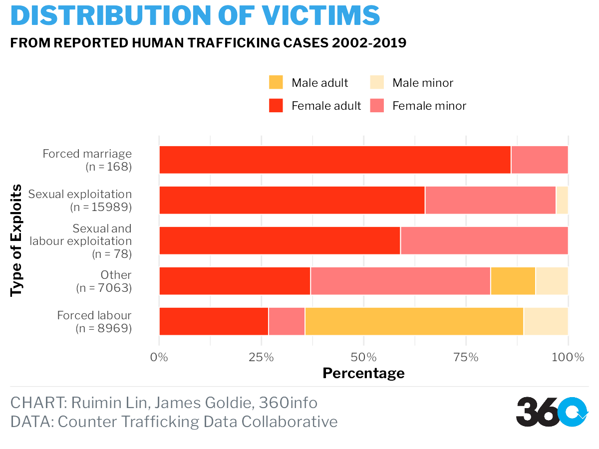

```{r setup, include=FALSE}
knitr::opts_chunk$set(echo = FALSE, warning = FALSE, message = FALSE)
library(plotly)
library(countrycode)
library(parsetR)
library(ggalluvial)
library(themes360info)
library(scales)
library(ggtext)
library(forcats)
library(knitr)
library(kableExtra)
library(gridExtra)
library(tidyverse)
library(patchwork)
```

# Abstract

The contemporary migration began from late 1960s, most with intention of obtaining a better life. However, the journey of migration for a number of people never reaches to their desired destination. Illegal migrants like refugees undertake sea journeys to across international boarder in seeking safety, many of those lost their lives when travelling on the sea under poor conditions. On the other hand, another group of migrants are being trafficked and forced to work as a modern slave.

The purpose of this report is to produce visualisations in association with [360info](https://360info.org/) platform to discover the underlying data story of this special group of migrants and raising the public awareness. Visualitsations produced will be focusing on two aspects, **missing migrants (refugees on the sea)** and **human trafficking**. Two datasets from [Missing Migrants Project](https://missingmigrants.iom.int/) and [Counter Trafficking Data Collaborative](https://www.ctdatacollaborative.org/dataset/resource/511adcb7-b1a2-4cc7-bf2f-0960d43a49cc) will be used to support the visualisation.

A brief result is discovered through the use of visualisation and supported datasets, that Mediterranean tends to be the major region where refugees lost their lives on. On the other hand, it is found that most trafficking cases are domestic. Details will be discussed in following sections.


# Background

Migration is the movement of an individual/a group of people from its usual place of residence to another place (within the country of residence or internationally) temporarily or permanently, either at its own will or being forced due to a variety of reasons. Apart from legal migrants, illegal migrants often took high risk sea travel to move away from its country of residence. 

"And for migrants who are leaving their country of origin to escape danger, the risks are high. Even those who survive the arduous journey often face another life-threatening challenge: statelessness. Denied citizenship of their destination country they are often unable to safely return to where they came from." Said Reece Hooker, the lead editor of the special report on The changing face of migration and migrants at 360info.

Many of those lost its live or gone missing in the process of migration. While migrants on the sea risking their lives to travel across international borders, a considerable number of migrants are being trapped under modern slavery and being forced to provide primarily labour/sexual services for free. The purpose of this report is to discover the changing condition of migrants that are missing on the sea and migrants are trafficked using violence/fraud.

# Objective

The report attempts to utilize the use of visualisations and in corporation of [360info](https://360info.org/) platform to raise the awareness of illegal and trafficked migrants for the public on International Refugees Day. Visualisations on migrants will be focused on discovering two aspects, missing migrants, and human trafficking overtime. 

For missing migrants, the visualisation attempts to give an overview on:

-	The missing and dead migrants overtime across regions
-	Death rate and cause of death

For the aspect in human trafficking, the visualisation aims to discover:

-	The route of trafficking, from which country most victims are located at, and to which country most victims are exploited?
-	Demographic features of victims and how it is related to type of exploits.

Missing migrants on the sea and Human trafficking are a global societal issue and it is crucial to keep track of reported incidents over time.

# Data

## Data Source

Two separate datasets are used in this report to explore the underlying story of missing migrants on the sea and human trafficking. The data for missing migrants is obtained from [Missing Migrants Project](https://missingmigrants.iom.int/), and the data for human trafficking is obtained from [Counter Trafficking Data Collaborative](https://www.ctdatacollaborative.org/dataset/resource/511adcb7-b1a2-4cc7-bf2f-0960d43a49cc). Both datasets are cleaned to ensure further exploration.

## Data Description

A brief description on variables used in the datasets are shown below:

**Missing Migrants**

```{r}
t1 <- tibble(
  Variable = c("Incident year", "Region of Incident", "Total Number of Dead and Missing"),
  Description = c("Year of incident reported",
                  "Region of incident happened",
                  "Total number of dead and missing migrants recorded by the incident, minimum 0")
)

t1 %>%
  kable(caption = "Variable description for Missing Migrants data") %>%
  column_spec(1, bold = TRUE, background = "lightblue") %>%
  kable_styling() %>%
  kable_paper() %>%
  scroll_box(width = "800px", height = "300px") %>%
  footnote(general = "Data collected from Missing Migrants Project")
```


**Human Trafficking**

```{r}
t2 <- tibble(
  Variable = c("Type of Exploits", "Gender Group",
               "Country of Citizenship", "Country of Exploitation"),
  Description = c("Type of exploits identified from reported victims",
                  "Indicates the reported victim's gender and whether the victims is under the age of 18 or older at the time the victim is registered. The variable consists of combination of original variables `gender` and `majorityStatus`.",
                  "Indicates the nationality of the reported victim",
                  "Indicates the last country where the victim was exploited")
)

t2 %>%
  kable(caption = "Variable description for Human Trafficking data") %>%
  column_spec(1, bold = TRUE, background = "lightblue") %>%
  kable_styling() %>%
  kable_paper() %>%
  scroll_box(width = "800px", height = "300px") %>%
  footnote(general = "Data collected from Coutner Trafficking Data Collaborative")
```

## Data Limitation

For both datasets, due to the specificity and sensitivity of the target group in data collection, it limits the completeness of the data. Many of incidents on the sea may not be found and reported. This goes the same for human trafficking data, a large number of cases are underreported, leading to the possibility that the dataset may only present a relatively small portion out of all trafficking happened around the world.

# Methodology

## Missing Migrants

### The missing and dead migrants overtime across regions

The purpose of this visualisation is to offer an immediately view of the number of dead and missing migrants overtime and across regions. Therefore, a heatmap is created at the first instance. Audiences could easily capture the region with darkest colour to be the most dangerous region that many migrants lost their lives in. However, a single heatmap is not enough as it does not have the ability to tell audience the number changing overtime. Therefore, two marginal plots are created in corporate with the heatmap as shown below, that fulfills the requirement of offering the audience a brief overview of the situation overtime and across  regions.

```{r}
mg <- read_csv("data/Missing_Migrants_Global_Figures_allData.csv")

mg <- mg %>%
  mutate_at(vars(8:14),
            funs(ifelse(is.na(.),0,.)))

# Converting NA values to 0, from columns `Number of Dead` to `Number of Children`. 
```

```{r}
mg1 <- mg %>%
  select(`Incident year`,
         `Region of Incident`,
         `Total Number of Dead and Missing`)

# warning summarize
mg1 <- mg1 %>%
  group_by(`Incident year`, `Region of Incident`) %>%
  summarise(`Total Number of Dead and Missing` = sum(`Total Number of Dead and Missing`)) %>%
  ungroup()


mg1 <- mg1 %>%
  complete(`Incident year`,
           `Region of Incident`)

mg1[is.na(mg1)] <- 0


mg1a <- mg1 %>%
  group_by(`Region of Incident`) %>%
  summarise(`Region total` = sum(`Total Number of Dead and Missing`)) %>%
  mutate(pct = round((`Region total`/sum(`Region total`)),4),
         Label = paste0(round(pct*100,1), "%"))

mg1b <- mg1 %>%
  mutate(`Incident year` = as.character(`Incident year`)) %>%
  group_by(`Incident year`) %>%
  summarise(`Year total` = sum(`Total Number of Dead and Missing`)) %>%
  mutate(pct = round((`Year total`/sum(`Year total`)),4),
         Label = paste0(round(pct*100,1), "%"))
  
```


```{r}
mhmv1 <- mg1 %>%
  mutate(`Incident year` = as.character(`Incident year`)) %>%
  ggplot(aes(x = `Incident year`,
             y = `Region of Incident`,
             fill = `Total Number of Dead and Missing`)) +
  geom_tile() +
  geom_text(aes(label = `Total Number of Dead and Missing`)) +
  scale_fill_gradient(low = "white", high = "red") +
  theme_minimal() +
  ggtitle("Heatmap version 1")

mhmv1
```


```{r}
mhm1 <- mg1 %>%
  mutate(`Incident year` = as.character(`Incident year`)) %>%
  ggplot(aes(x = `Incident year`,
             y = `Region of Incident`,
             fill = `Total Number of Dead and Missing`)) +
  geom_tile(colour = "black") +
  geom_text(aes(label = `Total Number of Dead and Missing`),
            size = 3) +
  scale_fill_gradient(low = "white", high = "red") +
  theme_minimal() +
  guides(fill="none") +
  theme(plot.caption = element_text(hjust = 0),
        axis.title.x = element_blank()) +
  labs(caption = "DATA: Missing Migrants Project")

mhm2 <- mg1a %>%
  ggplot(aes(x = `Region of Incident`, 
             y = pct,
             alpha = pct)) +
  geom_col(width = .7,
           fill = "red") +
  geom_text(aes(label = Label), hjust = -0.2, size = 3) +
  scale_y_continuous(expand = expansion(mult = c(.0, .25))) +
  theme_void() +
  scale_alpha_continuous(range = c(0.5, 1)) +
  guides(alpha="none") +
  coord_flip()

mhm3 <- mg1b %>%
  ggplot(aes(x = `Incident year`,
             y = pct,
             alpha = pct)) +
  geom_col(width = .7,
           fill = "red") +
  geom_text(aes(label = Label), vjust = -0.5, size = 3) +
  scale_y_continuous(expand = expansion(mult = c(.0, .25))) +
  theme_void() +
  scale_alpha_continuous(range = c(0.5, 1)) +
  guides(alpha="none") +
  labs(title = toupper("Dead and Missing Migrants"),
       subtitle = toupper(paste(
         "Number of dead and missing migrants from reported",
         "incidents 2014-2022",
         sep = "\n")))

layout <- "
AA#
BBC
BBC
BBC
BBC"
mhmp1 <- mhm3 + mhm1 + mhm2 + plot_layout(design = layout)

mhmp1 
```


## Human Trafficking

### The routes of trafficking

Human trafficking routes are visualised using the Sankey diagram, the aim of this visualisation is to explore the routes that most victims are trafficked to. At the first stage of creating the visualisation, an interactive html widget package called `parsetR` is attempted, however, this html widget has a lot of restriction in customizing the visualisation. The title and variable names cannot be modified, furthermore, it is not allowed to add 360 theme to align with the 360info’s style of visualisation. Therefore, `gg_alluvium` and `gg_stratum` is suggested by [James](https://github.com/jimjam-slam) to visualise the human trafficking routes.


```{r}
ht <- read_csv("data/The Global Dataset 14 Apr 2020.csv")


ht <- ht %>%
  select(-1) %>% # deselect unused column
  na_if(-99)     # replace all -99 values with NA as defined in the codebook

ht$typeOfExploitConcatenated[ht$typeOfExploitConcatenated ==
                               "Forced labour;Sexual exploitation;Combined sexual and labour exploitation"] <- "Sexual and labour exploitation"
```

```{r}
ht1 <- ht %>%
  select(yearOfRegistration,
         gender,
         ageBroad, citizenship,
         CountryOfExploitation)%>%
  mutate(yearOfRegistration = as.character(yearOfRegistration))

ht1a <- ht1 %>%
  mutate(citizenship = countrycode(citizenship, origin = 'iso2c',
                                   destination = 'country.name'),
         CountryOfExploitation = countrycode(CountryOfExploitation, origin = 'iso2c',
                                             destination = 'country.name')) %>%
  drop_na(citizenship, CountryOfExploitation)

ht1b <- ht1a %>%
  group_by(citizenship, CountryOfExploitation)%>%
  summarize(counts = n()) %>%
  ungroup() %>%
  arrange(desc(counts)) %>%
  head(10)

ht1b <- ht1b %>%
  rename(CountryOfOrigin = citizenship)

```


```{r}
parset(ht1b, dimensions = c('CountryOfOrigin', 'CountryOfExploitation'), 
       value = htmlwidgets::JS("function(d){return d.counts}"), 
       tension = 0.5)

```

```{r}
t1 <- grobTree(textGrob("Country of\nCitizenship",
                        gp=gpar(fontsize=13, fontface="bold",
                                fontfamily = "body360info")))

t2 <- grobTree(textGrob("Country of\nExploitation",
                        gp=gpar(fontsize=13, fontface="bold",
                                fontfamily = "body360info")))

# part of colour codes refer to https://thenode.biologists.com/data-visualization-with-flying-colors/research/
Okabe_Ito <- c("#D55E00", "#56B4E9", "#CC79A7", "#DDD723",
               "#0072B2", "#E69F00", "#55AD89", "#848282",
               "#B4E197")
# country of citizenship
# country of exploitation

victimflow <- ht1b %>%
  ggplot(aes(y = counts,
             axis1 = CountryOfOrigin,
             axis2 = CountryOfExploitation)) +
  geom_alluvium(aes(fill = CountryOfExploitation,
                    alpha = counts)) +
  geom_stratum(
    aes(fill = CountryOfExploitation),
    colour = NA) +
  scale_fill_manual(values = Okabe_Ito) +
  geom_text(stat = "stratum",
            aes(label = after_stat(stratum),
                fontface = 2),
            colour = "#FFFFFF",
            family = "body360info") +
  guides(fill="none",
         alpha = "none") +
  scale_x_continuous(breaks = NULL) +
  scale_y_continuous(labels = label_number(suffix = " K", scale = 1e-3)) +
  scale_alpha_continuous(range = c(0.2, 0.7)) +
  annotation_custom(t1,xmin=1,xmax=1,ymin=21200,ymax=Inf) +
  annotation_custom(t2,xmin=2,xmax=2,ymin=21200,ymax=Inf) +
  ylab("Number of Victims") +
  labs(title = toupper("Human Trafficking Victim Flows"),
       subtitle = toupper(paste(
         "10 Most common routes of human trafficking victims from reported",
         "cases 2002-2019",
         sep = "\n")),
       caption = paste(
         "**CHART:** Ruimin Lin, James Goldie, 360info",
         "**DATA:** Counter Trafficking Data Collaborative",
         sep = "<br>")) +
  theme_360() +
  theme(axis.text.x = element_blank(),
        axis.ticks.x = element_blank(),
        panel.background = element_blank())

# save_360plot(victimflow, "out/figures/victimflows.png",
#             shape = "photo-portrait")

```


```{r, echo=FALSE, out.width="80%"}
knitr::include_graphics("out/figures/victimflows.png")
```


### Demographic features of trafficking victim

To obtain a better understanding on victim’s features in relation to the type of exploits they suffered, a bar chart is considered at the first instance. 5 versions of bar charts are created before the final output of this visualisation is obtained. During the process of improving the visualisations, several methods of demonstrating the counts allocated to each victim group are attempted. At the later stage of developing the bar chart, percentages are in use to demonstrate the proportion of victims gender group that falls under the type of exploits they suffered.
Therefore, bar chart version 5 is created, and an error is quickly identified since the percentage bar does not add up to 1 for each type of exploits. The error occurred are the result of misusing `position = “dodge”` in `geom_col`. At the final stage, a well-polished stacked bar chart is created, with percentages showing the proportion of gender group within each category of type of exploits. In addition, under each type of exploits, the actual number of each category is labelled to avoid the possibility of misleading the audience, since the amount of reported victims in each type of exploit are quite distinct.


```{r}
fp1 <- ht %>%
  drop_na(typeOfExploitConcatenated) %>%
  ggplot(aes(x = typeOfExploitConcatenated, fill = gender)) +
  geom_bar(position = "dodge", width = .7) +
  theme_bw() +
  coord_flip() +
  ggtitle("Victim Distribution Chart Version 1")

```

```{r}
fp2 <- ht %>%
  drop_na(majorityStatus, typeOfExploitConcatenated) %>%
  ggplot(aes(x = typeOfExploitConcatenated, fill = gender)) +
  geom_bar(position = "dodge", width = .7) +
  theme_bw() +
  coord_flip() +
  facet_wrap(~majorityStatus) +
  ggtitle("Victim Distribution Chart Version 2")

```


```{r}
htEx <- ht %>%  # dataset for type of exploits
  select(gender, typeOfExploitConcatenated, majorityStatus) %>%
  drop_na(typeOfExploitConcatenated) %>%
  count(gender, typeOfExploitConcatenated) %>%
  group_by(typeOfExploitConcatenated) %>%
  mutate(pct = round((n/sum(n)),4)) %>%
  arrange(desc(n)) %>%
  head(10)

fp3 <- htEx %>%
  mutate(Label = paste0(n, "(",round(pct*100,2), "%", ")")) %>%
  ggplot(aes(x = typeOfExploitConcatenated, y = n,
             fill = gender)) +
  geom_col(position = "dodge") +
  geom_text(aes(label = Label),
            position = position_dodge(width = 0.9),
            size = 3) +
  theme_bw() +
  ggtitle("Victim Distribution Chart Version 3")


fp3 <- fp3 +
  theme(axis.text.x = element_text(size = 10, angle = 8))
```

```{r}
htEx1 <- ht %>%  # dataset for type of exploits
  select(gender, typeOfExploitConcatenated, majorityStatus) %>%
  drop_na(typeOfExploitConcatenated, majorityStatus) %>%
  count(gender, typeOfExploitConcatenated, majorityStatus) %>%
  group_by(typeOfExploitConcatenated) %>%
  mutate(pct = round((n/sum(n)),4)) %>%
  arrange(desc(n)) %>%
  head(16)

fp4 <- htEx1 %>%
  ggplot(aes(x = typeOfExploitConcatenated, y = n,
             group = gender,fill = gender, alpha = majorityStatus)) +
  geom_col(position = "dodge", colour = "darkgrey", width = 0.7) +
  theme_minimal() +
  theme(axis.text.x = element_text(size = 10, angle = 8)) +
  ggtitle("Victim Distribution Chart Version 4")

```


```{r}
colourp = c(Male = "#f6ce55", Female = "#990000")
# create a new column for gender and majoritystatus together
fp5 <- htEx1 %>%
  ggplot(aes(x = typeOfExploitConcatenated, 
             y = round(pct,2))) +
  geom_col(aes(fill = gender, group = typeOfExploitConcatenated, 
               alpha = majorityStatus),position = "dodge", colour = "darkgrey", width = 0.7) +
  scale_fill_manual(values = colourp) +
  theme_minimal() +
  coord_flip() +
  ylab("Percentage") +
  xlab("Type of Exploits") +
  ggtitle("Victim Distribution Chart Version 5")

```

```{r}
htEx1 <- htEx1 %>%
  mutate(genderGroup = 
           paste(gender, tolower(majorityStatus),
                 sep = ' '))
htEx1 <- htEx1 %>%
  group_by(genderGroup) %>%
  mutate(typeOfExploitConcatenated = fct_reorder(typeOfExploitConcatenated, 
                                                 pct)) %>%
  ungroup()

htEx1 <- htEx1 %>%
  mutate(genderGroup = fct_reorder(genderGroup, -pct))


excount <- ht %>%  # dataset for type of exploits
  select(gender, typeOfExploitConcatenated, majorityStatus) %>%
  drop_na(typeOfExploitConcatenated) %>%
  group_by(typeOfExploitConcatenated) %>%
  count(typeOfExploitConcatenated) %>%
  arrange(desc(n)) %>%
  head(6)

colourGP = c("Male adult" = "#ffc249",
             "Male minor" = "#ffeac1",
             "Female adult" = "#ff3212",
             "Female minor" = "#ff7b7b")

fp6 <- htEx1 %>%
  ggplot(aes(x = typeOfExploitConcatenated, 
             y = round(pct,2),
             label = scales::percent(pct))) +
  geom_col(aes(fill = genderGroup, 
               group = genderGroup),
           position = position_fill(reverse = TRUE),
           colour = "white",
           width = 0.7) +
  theme_360() +
  scale_fill_manual(values = colourGP) +
  scale_y_continuous(labels = scales::percent) +
  scale_x_discrete(labels = c("Sexual and labour exploitation" = 
  paste0(
    "Sexual and\nlabour exploitation\n", 
    "(n = ",
    excount$n[which(excount$typeOfExploitConcatenated==
                      "Sexual and labour exploitation")], ")"),
  "Sexual exploitation" = 
    paste0(
      "Sexual exploitation\n",
      "(n = ",
      excount$n[which(excount$typeOfExploitConcatenated==
                      "Sexual exploitation")],
      ")"),
  "Forced labour" = 
    paste0("Forced labour\n",
    "(n = ",
    excount$n[which(excount$typeOfExploitConcatenated==
                      "Forced labour")],
    ")"),
  "Other" = 
    paste0("Other\n",
    "(n = ",
    excount$n[which(excount$typeOfExploitConcatenated==
                      "Other")],
                      ")"),
  "Forced marriage" = 
    paste0("Forced marriage\n",
    "(n = ",
    excount$n[which(excount$typeOfExploitConcatenated==
                      "Forced marriage")],
    ")"))) +
  coord_flip() +
  ylab("Percentage") +
  xlab("Type of Exploits") +
  labs(title = toupper("Distribution of Victims"),
       subtitle = toupper("From reported human trafficking cases 2002-2019 "),
       caption = paste(
         "**CHART:** Ruimin Lin, James Goldie, 360info",
         "**DATA:** Counter Trafficking Data Collaborative",
         sep = "<br>")) +
  theme(legend.position = "top",
        legend.direction = "horizontal",
        legend.title = element_blank(),
        panel.grid.major.y = element_blank()) +
  guides(fill=guide_legend(nrow=2,byrow=TRUE))

# save_360plot(fp6, "out/figures/victimdistributions.png",
#             shape = "sdtv-landscape")

```


```{r}
# plot for demonstration

fp6a <- htEx1 %>%
  ggplot(aes(x = typeOfExploitConcatenated, 
             y = round(pct,2),
             label = scales::percent(pct))) +
  geom_col(aes(fill = genderGroup, 
               group = genderGroup),
           position = position_fill(reverse = TRUE),
           colour = "white",
           width = 0.7) +
  theme_minimal() +
  scale_fill_manual(values = colourGP) +
  scale_y_continuous(labels = scales::percent) +
  scale_x_discrete(labels = c("Sexual and labour exploitation" = 
  paste0(
    "Sexual and\nlabour exploitation\n", 
    "(n = ",
    excount$n[which(excount$typeOfExploitConcatenated==
                      "Sexual and labour exploitation")], ")"),
  "Sexual exploitation" = 
    paste0(
      "Sexual exploitation\n",
      "(n = ",
      excount$n[which(excount$typeOfExploitConcatenated==
                      "Sexual exploitation")],
      ")"),
  "Forced labour" = 
    paste0("Forced labour\n",
    "(n = ",
    excount$n[which(excount$typeOfExploitConcatenated==
                      "Forced labour")],
    ")"),
  "Other" = 
    paste0("Other\n",
    "(n = ",
    excount$n[which(excount$typeOfExploitConcatenated==
                      "Other")],
                      ")"),
  "Forced marriage" = 
    paste0("Forced marriage\n",
    "(n = ",
    excount$n[which(excount$typeOfExploitConcatenated==
                      "Forced marriage")],
    ")"))) +
  coord_flip() +
  ylab("Percentage") +
  xlab("Type of Exploits") +
  theme(legend.position = "top",
        legend.direction = "horizontal",
        legend.title = element_blank(),
        panel.grid.major.y = element_blank()) +
  guides(fill=guide_legend(nrow=2,byrow=TRUE)) +
  ggtitle("Victim Distribution Chart Version 6")
```

```{r}
grid.arrange(fp1,fp2,nrow = 2)
grid.arrange(fp3,fp4,nrow = 2)
grid.arrange(fp5,fp6a, nrow = 2, heights = c(1, 2))
```


# Discussion, and Results

## Missing Migrants


### 1.The missing and dead migrants overtime across regions

The heatmap demonstrates the changing in number of total missing and dead migrants overtime by opacity of the colour, the labelled number gives audiences further indication on the seriousness of incidents reported. The marginal plots on the top and side offers a quick view on the fluctuation on percentages of missing and death overtime and across the regions. The percentage is calculated by:

**(number of dead and missing migrants at one year / total number of dead and missing migrants from 2014 to 2022) * 100**

The method is also similar for percentage across regions.

**(number of dead and missing migrants in one region/total number of dead and missing migrants across all regions) * 100**

From the heatmap, the major region of migrant found dead and missing can be easily located at a glance, by looking at where all darker coloured tiles sit, which is Mediterranean. Taking up 46.3% of overall dead and missing migrants across the regions. Followed by Northern Africa (13.9%), North America (6%) and South-eastern Asia (5.9%). On the other hand, the year of tragedy can also be identified with the marginal plot at the top, which is the year of 2022. Taking up 17% of the overall dead and missing migrants from 2014 to 2022, followed by 2016 at 14%.

As a result, Mediterranean are identified as the most dangerous region since thousands of migrants lost its life when taking the risk to travel across the boarders each year.

```{r}
mhmp1
```


### 2. Death rate and cause of death

```{r}
mg2 <- mg %>%
  select(`Incident year`,
         `Website Date`,
         `Region of Incident`,
         `Total Number of Dead and Missing`,
         `Number of Survivors`,
         `Cause of Death`
         )

mg2 <- mg2 %>%
  mutate(`Total Number of Migrants` = `Total Number of Dead and Missing` + `Number of Survivors`,
         `Death rate` = round((`Total Number of Dead and Missing`/`Total Number of Migrants`)*100, 2))
```


```{r}
mg2 %>%
  ggplot(aes(x = `Website Date`,
             y = `Death rate`,
             colour = `Region of Incident`)) +
  geom_line()
```


## Human Trafficking


### 1. The Routes of Trafficking

The Sankey diagram gives an overview on the most common routes of victims being trafficked from reported cases 2002 to 2019, the opacity of the flow between `Country of Citizenship` and `Country of Exploitation` indicates number of victims. The result provided by the data is unanticipated as the route for most reported case of human trafficking victim is domestic. All reported case in Moldova, US, Philippines, Cambodia and Ghana are domestic. The majority of reported cases in Ukraine are domestic, with a small amount of cases flow to Russia. For across boarder trafficking, Russia is the main country of exploitation, with victims from Ukraine and Belarus. 

```{r, echo=FALSE, out.width="80%"}
knitr::include_graphics("out/figures/victimflows.png")
```


### 2. Features of Victims

A stacked bar chart is applied to demonstrate the demographic distribution of victims of all reported human trafficking cases from 2002 to 2019. Not surprisingly, Female adult are the main group of victims across most type of exploits recorded by the dataset. Sexual exploitation is the largest category of exploitation with 15989 reported cases fall under this category, followed by forced labour.  
Of all reported cases of sexual exploitation, around 60% of female adult are identified, following by female and male minor under sexual exploitation category. A small number of female adult and minor suffers from combination of sexual and labour exploitation. On the other hand, Male adult and male minor takes the majority, about 70% of all reported cases of forced labour.


```{r, echo=FALSE, out.width="80%"}

```


# Conclusion

After the explorations on both datasets through the process of producing visualisations, a series of data story about illegal and trafficked migrants is discovered. 

The heatmap on missing migrants indicates Mediterranean as the main region where majority of migrants on sea lost their lives on, furthermore, year 2022 are identified as the peak year of number of dead and missing migrants reported. 

The data story then turns to the human trafficking face. The Sankey diagram discovered an unanticipated fact, that with cases reported in the human trafficking dataset, many of most common human trafficking flows indicates victims are exploited within its country of citizenship. On the other hand, the stacked bar chart that demonstrates an overview on demographic distribution of victims, indicates the majority group of victims exploited, which are female adults within sexual exploitation category and male adults within forced labour category.

The visualisation produced in this report is associated with [Special report: Migration’s changing face]( https://360info.org/special-report-migrations-changing-face/). The aim of both report and visualisation is to raise the public awareness on migrants on international refugees’ day. 
The purpose of visualisations is to offer public an overview on the death of migrants on the seas, and the torture suffered by human trafficking victims.

As mentioned previously, due to the specificity of the target group in data collection, the datasets used in this report are unable to record all incidents and cases for missing & dead migrants on the seas and trafficked migrants. However, it is expected that the visualisations produced may raise the public awareness on the difficult experience of this group of special migrants suffered.

For furure analysis, it is expected that more incidents and cases can be found and recorded by increasing speed of information dissemination, hence contribute to efforts to better understand the causes of incidents, population that are more likely to suffer. 


# References

## R-package

@R-plotly
@R-countrycode
@R-parsetR
@R-ggalluvial
@R-themes360info
@R-scales
@R-forcats
@R-knitr
@R-kableExtra
@R-gridExtra
@R-tidyverse
@R-patchwork
@hooker_2022
@missing_migrants
@counter_trafficking


